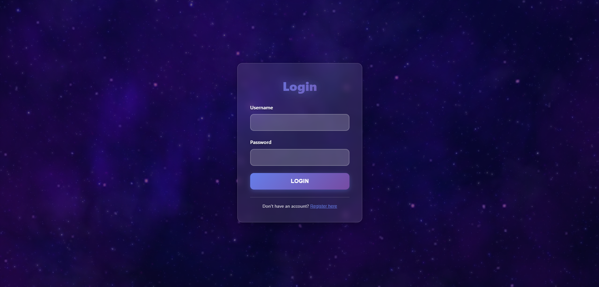
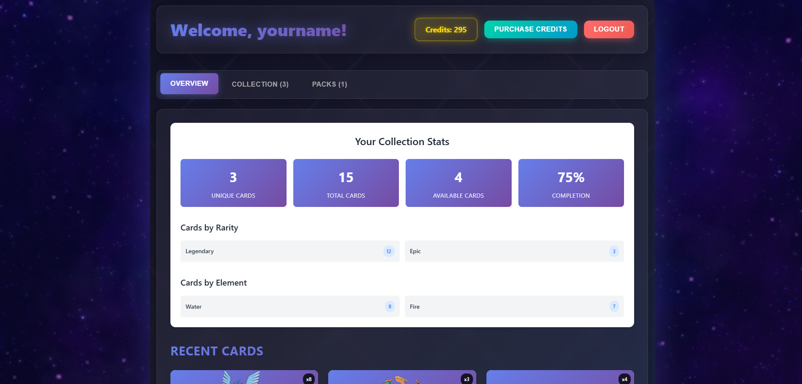
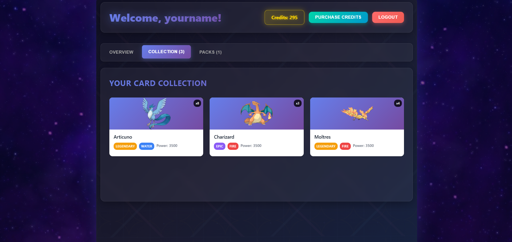
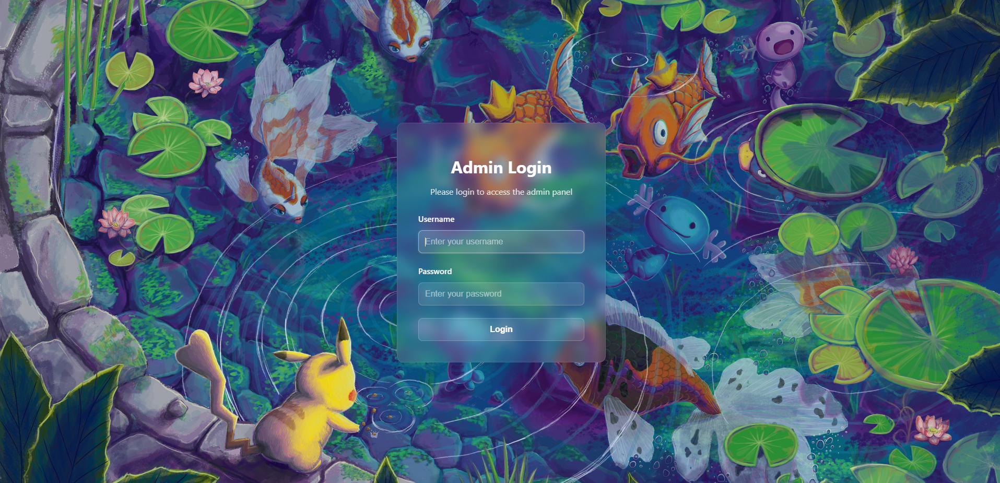
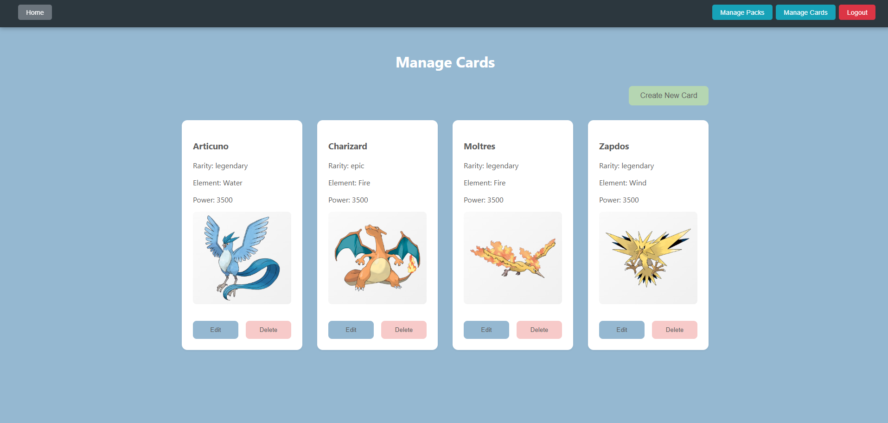
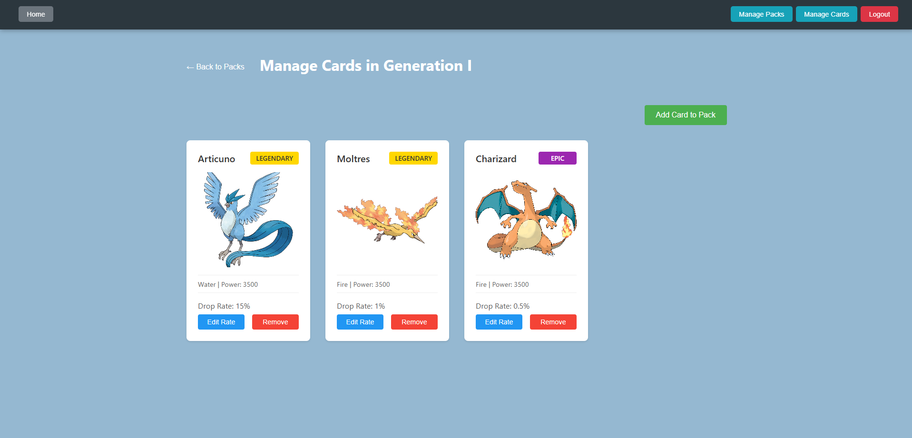
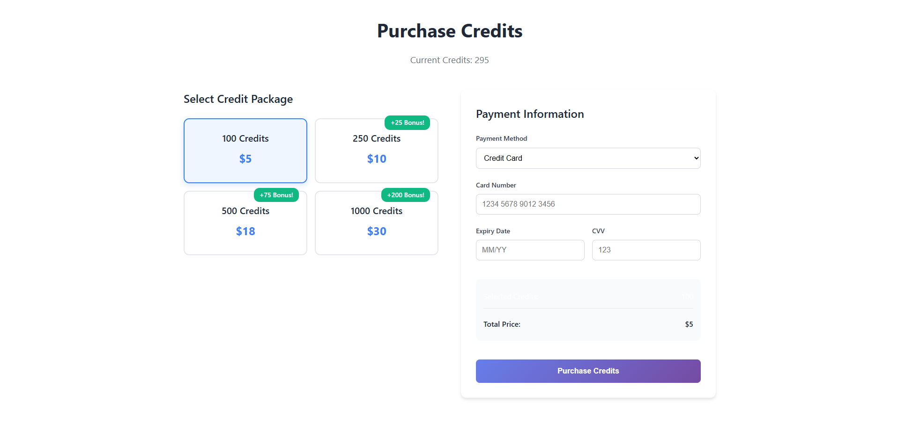

# 🃏 Card Collection Dashboard

A modern, immersive card collection dashboard built with Next.js and Express.js, featuring a dynamic card collection system with video backgrounds, interactive pack opening, and a sleek UI.

## ✨ Features

### 🎯 Core Functionality

- **User Authentication**: Secure login/register system with themed UI
- **Card Collection**: Collect and manage cards with different rarities and elements
- **Pack Opening**: Interactive pack opening with animated card reveals
- **Credit System**: Purchase and spend credits to open card packs
- **Admin Panel**: Full admin interface for managing cards, packs, and users

### 🎨 Visual Experience

- **Video Backgrounds**: Dynamic video backgrounds on all pages
- **Modern Aesthetics**: Dark theme with purple/blue gradients and glowing effects
- **Glass Morphism**: Modern UI with backdrop blur and transparency effects
- **Interactive Animations**: Smooth hover effects, card reveals, and transitions
- **Responsive Design**: Works perfectly on desktop, tablet, and mobile

### 🃏 Card System

- **Multiple Rarities**: Common, Uncommon, Rare, Epic, Legendary
- **Element Types**: Fire, Water, Earth, Wind, Dark, Holy
- **Power System**: Each card has unique power values
- **Collection Stats**: Track your progress and completion percentage

## 🛠️ Tech Stack

### Frontend

- **Next.js 14**: React framework with App Router
- **React**: Modern React with hooks and functional components
- **CSS Modules**: Scoped styling with themed design
- **Video Backgrounds**: HTML5 video with custom overlays
- **Material-UI**: Admin interface components (admin app)

### Backend

- **Node.js**: JavaScript runtime
- **Express.js**: Web application framework
- **SQLite**: Lightweight database (perfect for this project)
- **bcrypt**: Secure password hashing
- **JWT**: JSON Web Tokens for authentication
- **CSRF Protection**: Cross-site request forgery protection
- **CORS**: Cross-origin resource sharing

### Database

- **SQLite**: File-based database with automatic initialization
- **Structured Schema**: Users, cards, packs, and ownership tracking

## 📸 Screenshots

### 🎮 User Interface

#### Authentication

- **Login Page**: Gaming-themed login with video background
- **Register Page**: User registration with password confirmation

#### Main Dashboard

- **Overview Tab**: Collection stats and recent cards
- **Collection Tab**: Full card collection with quantity indicators
- **Packs Tab**: Available packs to purchase and open

#### Interactive Features

- **Pack Opening**: Animated card reveal with tap-to-reveal functionality
- **Card Collection**: Visual card display with rarity colors and stacking

### 🔧 Admin Interface

#### Admin Authentication

- **Admin Login**: Secure admin access portal with glass morphism design

#### Card Management

- **Manage Cards**: Create, edit, and delete cards
- **Card Details**: View card properties and images

#### Pack Management

- **Manage Packs**: Configure pack contents and costs
- **Pack Cards**: Assign cards to packs with drop rates

#### User Management

- **User Overview**: View user collections and statistics

### User Login Page



### Card Dashboard





### Pack Opening


### Admin Login



### Card Management



### Pack Management



### Payment



## 🚀 Quick Start

### Prerequisites

- Node.js (v18 or higher)
- npm or yarn

### Installation

1. **Clone the repository**

```bash
git clone <your-repo-url>
cd Capsulemon-main
```

2. **Install dependencies (Yarn Berry/monorepo setup)**

```bash
# Install all dependencies for all workspaces using Yarn Berry (PnP)
yarn install
```

3. **Start the development servers**

**Terminal 1 - Backend:**

```bash
cd server
yarn dev
```

**Terminal 2 - User Frontend:**

```bash
cd users
yarn dev
```

**Terminal 3 - Admin Frontend:**

```bash
cd admin
yarn dev
```

4. **Access the applications**

- **User Frontend**: http://localhost:3003
- **Admin Frontend**: http://localhost:3002
- **Backend API**: http://localhost:3001

## 🔐 Default Credentials

The database is automatically initialized with these default users:

### Regular User

- **Username**: `test`
- **Password**: `test`

### Admin User

- **Username**: `admin`
- **Password**: `admin`

## 📁 Project Structure

```
Capsulemon-main/
├── users/                  # Next.js user frontend (port 3003)
│   ├── app/                # App Router pages
│   ├── components/         # React components
│   ├── public/
│   │   └── videos/         # Video backgrounds
│   └── package.json
├── admin/                  # Next.js admin frontend (port 3002)
│   ├── app/                # Admin pages
│   ├── components/         # Admin components
│   ├── context/            # Admin context providers
│   ├── utils/              # Admin utilities
│   └── package.json
├── server/                 # Express.js backend (port 3001)
│   ├── routes/             # API routes
│   │   ├── packs/          # Pack-related routes
│   │   └── ...
│   ├── services/           # Business logic
│   │   ├── pack/           # Pack-related services
│   │   └── ...
│   ├── middleware/         # Auth & validation
│   ├── database/           # Database initialization
│   │   ├── schema.js       # Database schema
│   │   ├── seedData.js     # Initial data
│   │   └── initializer.js  # Database setup
│   └── package.json
├── shared/                 # Shared components and utilities
│   ├── auth/               # Authentication components
│   ├── components/         # Modal components
│   └── package.json
├── package.json            # Workspace configuration
└── README.md
```

## 🎮 Key Features Explained

### Video Backgrounds

- **Global video**: `bg_vid.mp4` plays on all pages
- **Dark overlay**: Ensures content readability
- **Performance optimized**: Proper z-index layering

### Card System

- **Unique cards**: Each card has ID, rarity, element, and power
- **Collection tracking**: Users can own multiple copies
- **Visual feedback**: Cards display with proper aspect ratios

### Pack Opening

- **Interactive reveals**: Click to reveal cards one by one
- **Animated transitions**: Smooth card flip animations
- **Progress tracking**: Visual progress bar during reveals

### Admin Features

- **Card management**: Create, edit, delete cards
- **Pack management**: Configure pack contents and costs
- **User management**: View user collections and stats

## 🎨 Design System

### Color Palette

- **Primary**: Purple/Blue gradients (#667eea to #764ba2)
- **Accent**: Gold (#ffd700) for credits and highlights
- **Success**: Teal (#00d4aa) for positive actions
- **Danger**: Red (#ff6b6b) for errors and destructive actions

### Typography

- **Headers**: Bold, gradient text with glowing effects
- **Body**: Clean, readable fonts with proper contrast
- **Buttons**: Uppercase with letter spacing for modern feel

### Animations

- **Hover effects**: Lift animations on interactive elements
- **Transitions**: Smooth 0.3s ease transitions
- **Loading states**: Pulsing animations for feedback

## 🔧 Development

### Adding New Features

1. **User Frontend**: Add components in `project/app/components/`
2. **Admin Frontend**: Add components in `admin/app/components/`
3. **Backend**: Add routes in `server/routes/`
4. **Database**: Update schema in `server/database/schema.js`

### Styling Guidelines

- Use CSS Modules for component-specific styles
- Follow the themed design with gradients and glows
- Maintain responsive design principles
- Use the established color palette

### Video Backgrounds

- Place videos in `project/public/videos/`
- Use `object-fit: contain` for full image display
- Add dark overlays for readability
- Ensure proper z-index layering

## 🚀 Deployment

### Frontend (Vercel)

```bash
# User frontend
cd users
yarn build
# Deploy to Vercel

# Admin frontend
cd admin
yarn build
# Deploy to Vercel
```

### Backend (Railway/Heroku)

```bash
cd server
yarn build
# Deploy to your preferred platform
```

## 🤝 Contributing

1. Fork the repository
2. Create a feature branch
3. Make your changes
4. Test thoroughly
5. Submit a pull request

## 📄 License

This project is licensed under the MIT License.

---

**Built with ❤️ and lots of card collection inspiration!** 🃏✨
